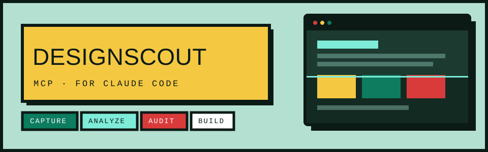
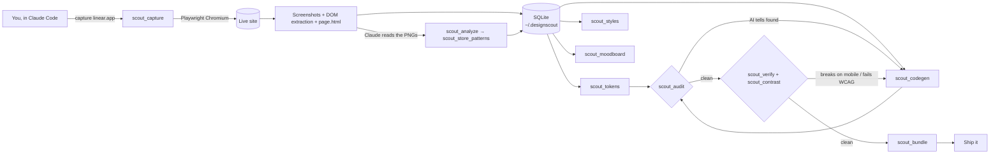

<p align="center">
  
</p>

<p align="center">
  
  
  
  = 20" src="https://img.shields.io/badge/node-%E2%89%A5%2020-0C1A16?style=flat-square">
  
  
</p>

<p align="center">
  <b>A browser, a design library, and a quality gate for <a href="https://docs.anthropic.com/en/docs/claude-code">Claude Code</a>.</b><br>
  Capture any website, extract its design system, and build from it — without the output looking AI-generated.
</p>

<p align="center">
  <a href="#install">Install</a> ·
  <a href="#tools">Tools</a> ·
  <a href="#usage">Usage</a> ·
  <a href="#anti-pattern-detection">Anti-patterns</a> ·
  <a href="#configuration">Config</a> ·
  <a href="#troubleshooting">Troubleshooting</a> ·
  <a href="CONTRIBUTING.md">Contributing</a>
</p>

---

## What it does

DesignScout runs a headless browser, captures how real websites look and are built, stores
the patterns in a local database, and generates tokens, components, mood boards, and audits
so that what you ship reads as designed by a person.

| | |
|---|---|
| **Capture** | Full-page screenshots at any viewport — or all three (mobile / tablet / desktop) in one call. Detects responsive breakage. Claude Code reads the images with its own vision. |
| **Extract** | Colours, type scale, fonts, icon sets, animation libraries, CSS variables, breakpoints — pulled straight from the live DOM, not guessed. |
| **Audit** | ~25 deterministic rules catch AI design tells (overused fonts, purple/cream palettes, gradient text, glassmorphism, icon-tile headings) and copy tells (em-dash density, filler phrases). No LLM. |
| **Generate** | Design tokens in 6 formats, three distinct style directions, audit-clean React / HTML components, and a guarded scroll-animation layer. Greys auto-tint toward the brand hue; font stacks avoid the monoculture. |
| **Verify** | Render the code you generated at mobile / tablet / desktop and report what breaks — horizontal overflow, tap-target size, missing viewport meta, broken images, console errors, WCAG contrast in light *and* dark. |
| **Crawl** | Walk a whole site, dedupe near-identical pages, and score cross-page consistency — font drift, palette spread, unstable nav. |

No API keys. Everything runs locally against a SQLite database in `~/.designscout/`.

---

## How it works



The MCP server never sends images over the wire. `scout_capture` writes PNGs to disk and
returns their paths; Claude Code opens them itself. Analysis, token generation, and auditing
are plain code.

---

## Install

### Prerequisites

| Requirement | Notes |
|---|---|
| **Node.js ≥ 20** | `node --version`. Node 20, 22, or 24 all work. |
| **Claude Code** | The CLI, desktop app, or an IDE extension. |
| **~400 MB disk** | For the bundled Chromium that Playwright downloads. |
| **Build tools** | `better-sqlite3` compiles a native addon. macOS: Xcode CLT. Linux: `build-essential` + `python3`. Windows: usually works out of the box with the Node installer's "native modules" option. |

### 1. Clone and build

```bash
git clone https://github.com/SpenceChakabva/designscout.git
cd designscout
npm install
npm run build          # compiles src/ → dist/
```

### 2. Install the browser

```bash
npx playwright install chromium
```

### 3. Register with Claude Code

**Option A — CLI (recommended).** `-s user` makes it available in every project:

```bash
claude mcp add designscout -s user -- node /ABSOLUTE/PATH/TO/designscout/dist/index.js
```

<sub>Windows PowerShell: use the full path with forward slashes, e.g.
`node C:/Users/you/designscout/dist/index.js`.</sub>

**Option B — edit the config file directly.**

| Client | File |
|---|---|
| Claude Code | `~/.claude.json` (macOS/Linux) · `%USERPROFILE%\.claude.json` (Windows) |
| Claude Desktop | `~/Library/Application Support/Claude/claude_desktop_config.json` (macOS) · `%APPDATA%\Claude\claude_desktop_config.json` (Windows) |

```jsonc
{
  "mcpServers": {
    "designscout": {
      "type": "stdio",
      "command": "node",
      "args": ["/ABSOLUTE/PATH/TO/designscout/dist/index.js"],
      "env": {}
    }
  }
}
```

### 4. Verify

Restart Claude Code (or run `/mcp` → reconnect), then:

```
/mcp
```

`designscout` should show **connected** with **23 tools**. If it says *failed*, run
`claude --debug` and check the stderr — the [troubleshooting](#troubleshooting) section
covers the usual causes.

### Updating

```bash
cd designscout && git pull && npm install && npm run build
```

Then `/mcp` → reconnect (or start a new session). The server always launches from `dist/`,
so a rebuild is all it takes.

---

## Tools

| Tool | What it does |
|---|---|
| `scout_capture` | Visit a URL, scroll the full page, capture viewport screenshots. Responsive mode (mobile/tablet/desktop in one call), `selector`-scoped capture, responsive layout-breakage detection, cookie-banner dismissal. Persists the raw HTML for later auditing. |
| `scout_analyze` | Return screenshot paths + the analysis schema for Claude Code to fill in visually. |
| `scout_store_patterns` | Save Claude Code's structured analysis to the database. |
| `scout_search` | Query the pattern database by keyword and category. |
| `scout_tokens` | Generate tokens: `json`, `css`, `tailwind`, `style-dictionary`, `w3c` (DTCG), `figma` (Tokens Studio). |
| `scout_styles` | Three design directions — Refined, Bold, Expressive — each with its own token set. |
| `scout_codegen` | Scaffold a component (`hero`, `navbar`, `card`, `footer`, `features`, `testimonials`, `cta`, `pricing`) as React or HTML from a token set. Runs the audit rules on its own output and reports the result. |
| `scout_checklist` | Pre-generation checklist for a captured site — turns imagery, motion, forms, theming, responsive coverage, fonts, and bundling into explicit decisions, each seeded from what the reference actually does. |
| `scout_moodboard` | Build a neubrutalist HTML mood board from captured sites. |
| `scout_compare` | Screenshot paths + patterns for two or more sites, side by side. |
| `scout_motion` | Emit a guarded scroll-animation layer (CSS + JS) — reveal, parallax, line-mask, count-up, marquee, magnetic, blur-in, optional View Transitions theme swap — as dependency-free vanilla JS or GSAP 3 + ScrollTrigger (+ Lenis). Hard-bails under `prefers-reduced-motion`. |
| `scout_bundle` | Make a built HTML file self-contained and CSP/sandbox-safe: inline remote images as `data:` URIs and allowlisted CDN `<script>`/`<style>`, add missing charset/viewport meta. |
| `scout_deps` | Resolve exact pinned versions and ready-to-paste `<script src>` URLs for CDN libraries — cdnjs, then jsDelivr. |
| `scout_audit` | Anti-pattern detection on a file, raw text, or a captured site (real HTML + extracted styles + tokens). Now also flags a missing `<meta viewport>` / `<html lang>` on full documents. |
| `scout_a11y` | Deterministic accessibility scan — alt text, control names, labels, heading order, landmarks, focus rings — with a 0–100 score. |
| `scout_verify` | Render generated HTML — a file, a string, or a URL — in headless Chromium at mobile/tablet/desktop and report what breaks: horizontal overflow with the offending elements, sub-44px tap targets, sub-12px text, missing meta, broken images, console errors, inline-script syntax errors, AI design-tell lint. |
| `scout_contrast` | WCAG 2.1 contrast for a single pair, a CSS file, or a whole token set — token mode runs a light + dark theme-pair report so a combo that passes one theme but fails the other is caught. Returns exact ratios and a lightness-nudged fix per failure. |
| `scout_inventory` | Component inventory from the live DOM: buttons, inputs, cards, badges grouped by variant with computed styles and counts. |
| `scout_designmd` | Generate an [impeccable](https://github.com/pbakaus/impeccable)-compatible `DESIGN.md`. |
| `scout_crawl` | Breadth-first crawl of a site's internal pages, screenshot + design signals per page, near-duplicate pages deduped. |
| `scout_consistency` | Cross-page consistency report from a crawl (font drift, palette spread, unstable nav/footer) with a 0–100 score and an HTML report. |
| `scout_list` · `scout_delete` | Manage captured sites and crawls. |

---

## Usage

In Claude Code, just describe what you want:

```
"Capture linear.app, analyze the design, and build me a landing page in that style"

"Capture stripe.com responsively and tell me what breaks on mobile"

"Capture vercel.com, then show me 3 design directions based on it"

"Crawl docs.stripe.com and report where the design drifts between pages"

"Audit src/app/page.tsx for AI design and copy tells"

"Capture resend.com, generate a W3C token file and a DESIGN.md from it"
```

**Full pipeline:**

```
"Capture linear.app, vercel.com, and resend.com. Analyze each, compare them,
generate 3 style directions, then build a landing page with the one I pick.
Audit the result before showing me."
```

### CLI

Every tool has a matching subcommand — useful for scripting or piping context.

```bash
npx tsx src/cli.ts capture https://linear.app --responsive
npx tsx src/cli.ts capture https://linear.app --selector "header nav"
npx tsx src/cli.ts list
npx tsx src/cli.ts search "dark minimal hero"
npx tsx src/cli.ts tokens --site-id <id> --format w3c
npx tsx src/cli.ts styles --site-id <id>
npx tsx src/cli.ts codegen hero --framework html -o hero.html
npx tsx src/cli.ts audit --site-id <id>
npx tsx src/cli.ts a11y --url https://linear.app
npx tsx src/cli.ts inventory --url https://linear.app
npx tsx src/cli.ts crawl https://linear.app --max-pages 15 --max-depth 2
npx tsx src/cli.ts consistency
npx tsx src/cli.ts moodboard --title "SaaS Inspiration"
npx tsx src/cli.ts designmd --site-id <id> --output DESIGN.md
npx tsx src/cli.ts serve            # run the MCP server over stdio
```

---

## Anti-pattern detection

`scout_audit` runs ~25 deterministic rules across three categories. Point it at a file,
raw text, or a captured `site_id` (which audits the real HTML plus the DOM-extracted
colours, fonts, and animation stack).

**Design slop** — overused fonts, cream/beige surfaces, purple/violet palettes, Tailwind
default colours, gradient text, glow shadows, radial halos, side-tab borders, bounce easing,
glassmorphism, stacked `100vh` sections, uniform `rounded-xl` on everything, emoji headings,
icon-tile-above-heading, staggered scroll reveals.

**Copy tells** — em-dash overuse, exclamation density, ellipsis overuse, `Label:` header
patterns, trailing-arrow overuse, template metrics, template testimonials, 30+ AI filler
phrases.

**Quality** — pure greys without hue tint, pure black, grey text on coloured backgrounds,
WCAG AA contrast failures, too many typefaces, too many pinned elements, multiple animation
libraries.

`scout_a11y` adds a separate deterministic accessibility pass with its own 0–100 score.

DesignScout uses [impeccable](https://github.com/pbakaus/impeccable) for design-quality
enforcement, and its generated components and default token set pass their own audit.

---

## Token formats

| `--format` | Output |
|---|---|
| `json` | The raw `DesignTokenSet` |
| `css` | `:root { --color-*, --font-*, --space-*, --radius-*, --shadow-* }` |
| `tailwind` | A `tailwind.config` `theme.extend` object |
| `style-dictionary` | Style Dictionary v3 source (`{ value }` leaves) |
| `w3c` | W3C Design Tokens Community Group format (`$type` / `$value`) |
| `figma` | Tokens Studio for Figma (single `global` set) |

---

## Configuration

Set these before launching the server (or in the MCP config's `env` block).

| Variable | Default | Purpose |
|---|---|---|
| `DESIGNSCOUT_DATA` | `~/.designscout` | Root for the DB, screenshots, and outputs |
| `DESIGNSCOUT_NAV_TIMEOUT` | `45000` | Per-navigation timeout (ms) |
| `DESIGNSCOUT_RETRIES` | `2` | Navigation retries before giving up |
| `DESIGNSCOUT_SCROLL_DELAY` | `400` | Delay between scroll steps (ms) |
| `DESIGNSCOUT_MAX_SCROLLS` | `30` | Lazy-load scroll budget hint |
| `DESIGNSCOUT_CRAWL_MAX_PAGES` | `20` | Default page cap for `scout_crawl` |
| `DESIGNSCOUT_CRAWL_MAX_DEPTH` | `2` | Default link depth for `scout_crawl` |

---

## Data

```
~/.designscout/
├── designscout.db          SQLite database (sites, patterns, tokens, crawls, audits)
├── screenshots/
│   ├── <site-id>/          Viewport frames, full_page.png, page.html
│   └── crawl-<id>/         Per-page crawl screenshots
└── outputs/                Mood boards and consistency reports (HTML)
```

The database migrates itself on open (tracked by `PRAGMA user_version`).

---

## Development

```bash
npm run build        # tsc → dist/
npm test             # node:test suites via tsx (43 tests)
npx tsc --noEmit     # type-check only
npm run dev          # run the MCP server from source with tsx
```

Layout:

```
src/
├── mcp/            server.ts (tool registration) · tools.ts (handlers)
├── browser/        session · capture · extract · crawl · inspect
├── audit/          rules (anti-patterns) · a11y (accessibility scoring)
├── outputs/        tokens · codegen · moodboard · consistency · designmd
├── store/          db (migrations) · queries
└── shared/         types · config (viewport presets, env knobs)
```

See [ARCHITECTURE.md](ARCHITECTURE.md) for the full picture.

---

## Troubleshooting

**`/mcp` shows designscout as *failed*.**
Run `claude --debug` and read the stderr from the server launch. The path in `args` must be
absolute and point at `dist/index.js` — not `src/`.

**`NODE_MODULE_VERSION` mismatch / `better_sqlite3.node` error.**
The native addon was built against a different Node version. Rebuild it:
```bash
npm rebuild better-sqlite3
```

**`browserType.launch: Executable doesn't exist`.**
Playwright's Chromium isn't installed:
```bash
npx playwright install chromium
```

**Captures hang or time out on heavy sites.**
Raise the budget: `DESIGNSCOUT_NAV_TIMEOUT=90000`. Some sites never reach network-idle;
DesignScout already falls back to `domcontentloaded` + a settle delay.

**`__name is not defined` when running via `tsx`.**
Handled — `src/browser/session.ts` injects a shim so esbuild-transformed extractor
functions survive `page.evaluate`. If you see it, you're on an old build; `npm run build`.

**Nothing is captured / `coveragePercent` is low.**
The page may gate content behind a consent wall DesignScout couldn't dismiss. Try
`--no-dismiss-banners` off (it's on by default) or capture a specific `--selector`.

---

## Roadmap

- [x] DOM style extraction (computed styles, fonts, icons, animations)
- [x] Deterministic anti-pattern detection (no LLM)
- [x] `DESIGN.md` generation (impeccable-compatible)
- [x] Style direction generation (Refined, Bold, Expressive)
- [x] Responsive capture + layout-breakage detection
- [x] Selector-scoped capture
- [x] Component code generation (React / HTML)
- [x] Style Dictionary / W3C DTCG / Figma token export
- [x] Multi-page crawling + cross-page consistency report
- [x] Deterministic accessibility scan
- [x] Live component inventory
- [ ] Web UI for browsing the inspiration database
- [ ] Visual regression diffing between captures

---

## License

MIT — see [LICENSE](LICENSE).
